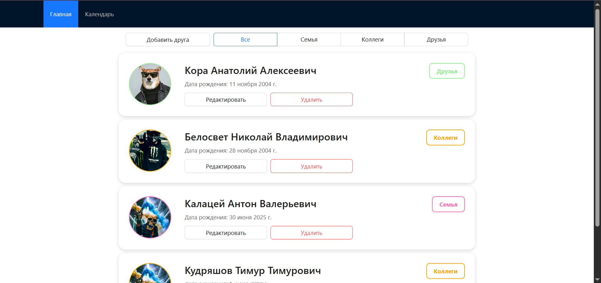
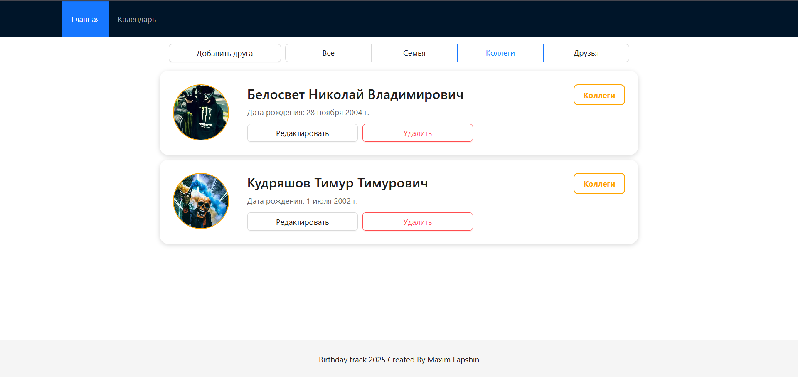
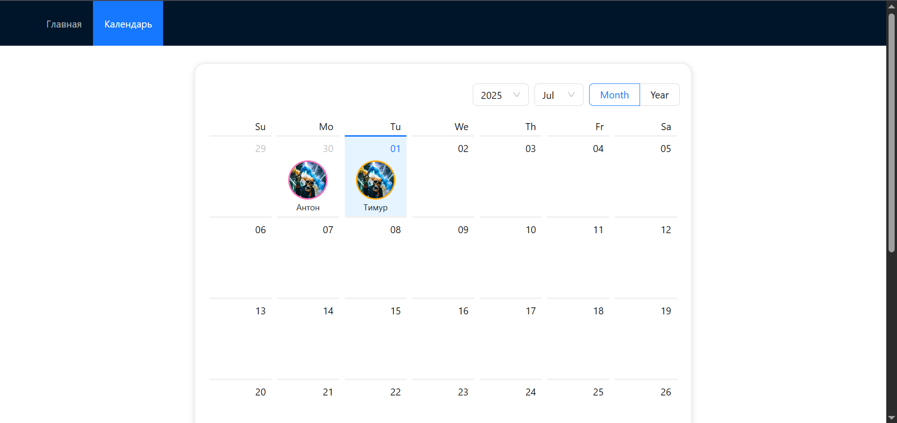

# 🎉 BirthdayTrack - Поздравлятор

## 📝 Описание проекта

BirthdayTrack - это полноценное SPA-приложение для учета дней рождения друзей, знакомых и коллег с функцией автоматической рассылки напоминаний.

**Основные возможности:**
- 📅 Ведение списка дней рождения
- 🔔 Автоматическая рассылка уведомлений
- 🖼 Хранение фотографий именинников
- 📱 Удобный веб-интерфейс

## 🛠 Технологический стек

**Backend:**
- ASP.NET Core Web API
- Entity Framework Core
- PostgreSQL
- Telegram.Bot (для рассылки уведомлений)

**Frontend:**
- React.js
- TypeScript
- Node.js
- Next

## 🚀 Установка и запуск

### Предварительные требования
- [.NET 6.0+](https://dotnet.microsoft.com/download)
- [Node.js 16+](https://nodejs.org/)
- [PostgreSQL](https://www.postgresql.org/download/)
- [Visual Studio 2022](https://visualstudio.microsoft.com/) и [VS Code](https://code.visualstudio.com/)

### Backend

1. **Клонируйте репозиторий**
```bash
 git clone https://github.com/yourusername/BirthdayTrack.git
 cd BirthdayTrack
```
3. **Установите dotnet-ef (если еще не установлен)**
```bash
 dotnet tool install --global dotnet-ef
```
3. Настройте базу данных
 - Убедитесь, что у вас установлен PostgreSQL
 - Отредактируйте строку подключения в appsettings.json
 - Выполните миграции:
  ```bash
   dotnet ef database update -s ./BirthdayTrack.API -p ./BirthdayTrack.Data/
  ```
4. Запустите API
```bash
   dotnet run --project ./BirthdayTrack.API/
```

### Frontend

1. Перейдите в папку frontend
  ```bash
   cd ./Frontend/birthdaytrack/
  ```
2. Установите зависимости
  ```bash
   npm install
  ```
3. Запустите приложение
  ```bash
   npm run dev
  ```

4.Откройте веб-приложение в браузере
  ```bash
   http://localhost:3000
  ```
### Настройка Telegram бота для уведомлений
 - Создайте бота через @BotFather
 - Получите токен бота
 - Добавьте токен в appsettings.json:
```json
   "TelegramBot": {
   "Token": "YOUR_BOT_TOKEN",
   "NotificationTime": "09:00"
 }
```

📌 **Особенности реализации**
## Backend
 - Автоматическая рассылка уведомлений через Telegram
 - ранение фотографий в базе данных 
 - Поддержка CORS для фронтенда

## Frontend
 - Адаптивный дизайн
 - Сортировка и фильтрация дней рождения
 - Формы добавления/редактирования записей
 - Отображение ближайших дней рождения на главной странице

# 🎨 Дизайн веб-приложения BirthdayTrack
## 📱 Скриншоты интерфейса

### 1. Полный список пользователей

*Рис. 1: Главная страница со списком всех пользователей. Отображаются: аватар, имя, дата рождения и категория (друг/коллега/родственник).*

---

### 2. Фильтр "Коллеги"

*Рис. 2: Отфильтрованный список только коллег. Сортировка по ближайшим дням рождения. Верхний тулбар позволяет быстро переключаться между категориями.*

---

### 3. Календарное представление

*Рис. 3: Календарный вид с отметками дней рождений.*

